# chaino — Python and MicroPython Host Library for controlling Chaino (Arduino) Devices

`chaino` module lets a PC communicate with an Arduino/compatible board that runs the Chaino firmware over **Serial (USB)**. You can remotely execute functions registered on the Chaino board, pass arguments, and receive return values.  

This module can also be used in **MicroPython**, where a MicroPython device acts as a host and controls a Chaino device connected via **I²C**. In this case, all communication and function execution happen over the I²C bus.  

It uses **CRC-16/XMODEM** for integrity and includes robust resend/retry logic to ensure reliable data transmission.

---

## 📦 Requirements & Installation

### 🖥️ CPython (PC / Server)
- **Requirements**
  - Python 3.8+
  - [pyserial](https://pypi.org/project/pyserial/) — **must be installed**
- **Installation Order**
```bash
pip install pyserial
pip install chaino
```
> **Note:** For compatibility with MicroPython, `chaino` does not automatically install `pyserial` when installed in Host PC.


---

### 📟 MicroPython (on device)
- **Requirements**
  - A MicroPython-compatible board (e.g., Raspberry Pi Pico / ESP32)
  - `chaino` installed on the MicroPython filesystem
- **Installation**
  1. Open [Thonny IDE](https://thonny.org/)
  2. Connect your MicroPython device
  3. Go to **Tools → Manage packages...**
  4. Search for `chaino` and click **Install** (from PyPI)

  Alternatively, you can enter this in Thonny's package manager command box:
  ```
  chaino
  ```
- **Usage**
  - In MicroPython, `chaino` communicates with the target Chaino device via **I²C**.
  - You can send commands and read responses from the connected Chaino board using the same API methods as in CPython, with `port` replaced by I²C parameters.

---

## 🔗 Usage Overview
- **CPython**: `Serial (USB)` connection from a PC to the Chaino device. The Chaino deivce may have multiple slave Chaino devices via I²C.

```mermaid
graph TD
    PC["PC<br/>(Python)"] -- Serial --> Dev0[Chaino Board]
    Dev0 -- I²C --> Dev1[Chaino Board #1]
    Dev0 -- I²C --> Dev2[Chaino Board #2]
```


- **MicroPython**: `I²C` connection from a MicroPython device to the Chaino device  

```mermaid
graph TD
    Dev0["Micropython Board"]
    Dev0 -- I²C --> Dev1[Chaino Board #1]
    Dev0 -- I²C --> Dev2[Chaino Board #2]
```


CPython or MicroPython can create an instance of the `Chaino` class or a subclass of it (e.g., the `chaino.Hana` class). When creating an instance, specify the serial port name or the I²C address. You can control the Chaino device using the created object, and the usage is designed to be the same in both CPython and MicroPython.

---

## 📋 Example

### CPython Example
```python
from chaino import Chaino, Hana

# Generate Chaino object via Serial
dev = Chaino("COM3")  
print( dev.who() )

# generate Hana object 
# and call analogRead(26) function of chaino.Hana device
dev2 = Hana("COM3", 0x40)
adc = dev2.read_analog(26)
print(adc)
```

### MicroPython Example
```python
from chaino import Chaino, Hana

# Generate Chaino object via I2C
dev = Chaino(0x40)  
print( dev.who() )

# generate Hana object 
# and call analogRead(26) function of chaino.Hana device
dev2 = Hana(0x41)
adc = dev2.read_analog(26)
print(adc)
```
